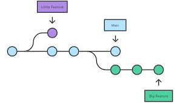

# :wave: The Basics of GitHub 

## 🤓 Course overview and learning outcomes 

The goal of this course is to give you a brief introduction to GitHub. We’ll also provide you with materials for further learning and a few ideas to get you started on our platform. 🚀

## :octocat: Git and GitHub

Git is a distributed Version Control System (VCS) that helps track changes in your code, making it easy to revert to older versions and collaborate with others.

GitHub is an online platform that enhances Git with a user-friendly interface, enabling teams to work together and manage project history. It’s widely used for software development, data visualization, game building, and more.

GitHub is a website that stores your stuff, and you can utilize Git to manage it.

This course will cover the basics of GitHub, with more advanced topics to come!

## :octocat: Understanding the GitHub flow 

The GitHub flow is a lightweight workflow that allows you to experiment and collaborate on your projects easily, without the risk of losing your previous work.

### Repositories

A repository (repo) is a storage space where your project’s files and version history are kept. It tracks changes, allowing you to collaborate with others, revert to previous versions, and manage code efficiently.

### Cloning 

When you create a GitHub repository, it’s stored remotely in the cloud. **Cloning** a repository creates a local copy on your computer, allowing you to sync changes, work with your preferred tools, and access all past versions of files. This is useful if you need to revert to an earlier version of your project.

### Committing and pushing
**Committing** and **pushing** let you save and share changes with your remote repository.  
- **Commit**: Saves changes locally with a message describing the update (e.g., “Added README”).  
- **Push**: Uploads committed changes to GitHub so others can see your work.

At first, this process may feel new, but you'll get the hang of it quickly!


## 💻 GitHub terms to know 


### README Files  
Repositories often include a **README** to explain the project's purpose, usage, and setup. A well-written README helps others understand and contribute to your project.  

We’re using this README to guide you through learning Git and GitHub! 😄  
### Repositories 


Repositories also contain **README**s. You can add a README file to your repository to tell other people why your project is useful, what they can do with your project, and how they can use it. We are using this README to communicate how to learn Git and GitHub with you. 😄 

### Branches
Branches in GitHub let you work on new features, bug fixes, or experiments without affecting the main project. You create a branch from the default main branch, making a separate copy of your project. Once you're happy with the changes or a teammate reviews them, you can merge them back into main.


### Forks
A fork is another way to copy a repository, but is usually used when you want to contribute to someone else’s project. Forking a repository allows you to freely experiment with changes without affecting the original project and is very popular when contributing to open source software projects!




### Pull requests
A pull request lets you share changes with others and get feedback before merging into main. You can discuss, review, and update your changes as needed. Adding reviewers highlights who you want feedback from. Once approved, the pull request can be merged.


### Issues
Issues are a way to track enhancements, tasks, or bugs for your work on GitHub. Issues are a great way to keep track of all the tasks you want to work on for your project and let others know what you plan to work on. You can also use issues to tell a favorite open source project about a bug you found or a feature you think would be great to add!

For larger projects, you can keep track of many issues on a project board. GitHub Projects help you organize and prioritize your work and you can read more about them [in this "About Project boards document](https://docs.github.com/en/github/managing-your-work-on-github/about-project-boards). You likely won’t need a project board for your assignments, but once you move on to even bigger projects, they’re a great way to organize your team’s work!
You can also link together pull requests and issues to show that a fix is in progress and to automatically close the issue when someone merges the pull request.
To learn more about issues and linking them to your pull requests, read ["About Issues"](https://docs.github.com/en/github/managing-your-work-on-github/about-issues). 

### Your user profile

Your profile page tells people the story of your work through the repositories you're interested in, the contributions you've made, and the conversations you've had. You can also give the world a unique view into who you are with your profile README. You can use your profile to let future employers know all about you! 
To learn more about your user profile and adding and updating your profile README, read ["Managing Your Profile README"](https://docs.github.com/en/github/setting-up-and-managing-your-github-profile/managing-your-profile-readme). 

### Using markdown on GitHub 

You might have noticed already, but you can add some fun styling to your issues, pull requests, and files. ["Markdown"](https://guides.github.com/features/mastering-markdown/) is an easy way to style your issues, pull requests, and files with some simple syntax. This can be helpful to organize your information and make it easier for others to read. You can also drop in gifs and images to help convey your point!
To learn more about using GitHub’s flavor of markdown, read ["Basic Writing and Formatting Syntax"](https://docs.github.com/en/github/writing-on-github/basic-writing-and-formatting-syntax). 

### Engaging with the GitHub community

The GitHub community is vast. There are many types of people who use GitHub in their day to day—students like you, professional developers, hobbyists working on open source projects, and explorers who are just jumping into the world of software development on their own. There are many ways you can interact with the larger GitHub community, but here are three places where you can start. You can star repos, follow users and use github explore to find cool stuff.


### Essential Git Commands

- **`git add .`** → Stages all changes for commit.  
- **`git commit -m "message"`** → Saves changes with a description.  
- **`git push`** → Uploads commits to the remote repository.  
- **`git pull`** → Fetches and merges the latest changes from the remote repo.  

These commands help track, save, and sync your work efficiently.


## 📝 Submission steps 

* Clone this repo somewhere
  1. ```git clone <repoURL>.git```
  2. Or use Codespaces! from the "Code" button at the top of your repo navigate to "Codespaces" and click on "Create codespace on main"
* Using the terminal, create a new branch and call it "gitAssignmentBranch"
  1. ```git branch gitAssignmentBranch```
  2. ```git checkout gitAssignmentBranch```
* Add a new markdown file called "GitAssignmentFML.md" (where FML stands for your First, Middle and Last name initials). 
* Add some content in the file: <strong>Let them know what you learned from this README reading, what you are still confused about! or simply let me know what you are excited to learn this semester.</strong> Experiment with different styles! (Minimum requirement: 200 words, 1 Title, 1 list, 1 table, 1 hyperlink, and 1 image)
  1. [Markdown Cheatsheet](https://www.markdownguide.org/cheat-sheet/)
* Push all the files modified from the command line you'll need to run the following commands on the terminal in order:
  1. ```git add *```
    - '*' and '.' are interchangeable, they mean "all changes"; you can also add individual files by replacing * for the name of the file.
  2. ```git commit -m "Add a comment explaining the files changed/added"```
    - The comment will appear in Github and will help to find changes quicker
  3. ```git push origin gitAssignmentBranch```
* Return to your repo in Github.com and open a Pull Request, a prompt should appear on top letting you do this in one click (If not follow the slides `Intro to Github` to know how to open one manually.
  1. Add a comment to your Pull request and submit a comment in Blackboard letting me know you've done this.
 

## 📚  Resources 
* [A short video explaining what GitHub is](https://www.youtube.com/watch?v=w3jLJU7DT5E&feature=youtu.be) 
* [Git and GitHub learning resources](https://docs.github.com/en/github/getting-started-with-github/git-and-github-learning-resources) 
* [Understanding the GitHub flow](https://guides.github.com/introduction/flow/)
* [How to use GitHub branches](https://www.youtube.com/watch?v=H5GJfcp3p4Q&feature=youtu.be)
* [Interactive Git training materials](https://githubtraining.github.io/training-manual/#/01_getting_ready_for_class)
* [GitHub's Learning Lab](https://lab.github.com/)
* [Education community forum](https://education.github.community/)
* [GitHub community forum](https://github.community/)
