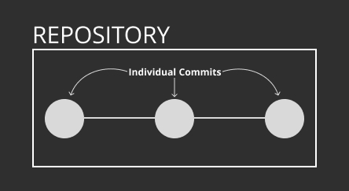
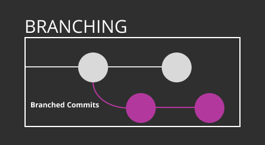
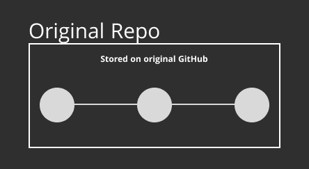
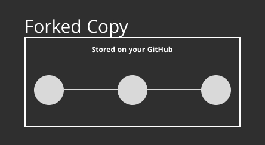
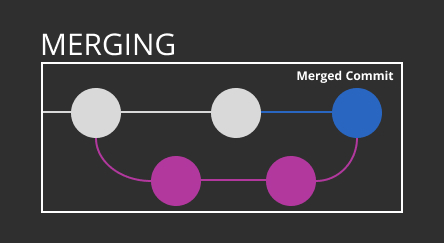
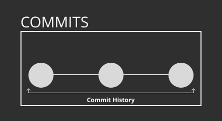

# 👋 Introduction to GitHub

Welcome! This guide provides a beginner-friendly introduction to GitHub. By the end, you'll understand how to collaborate using GitHub, track your changes, and navigate essential workflows like cloning, branching, and pull requests. 🚀

---

## 🎯 Course Objectives

By completing this course, you will:
- Understand the purpose of Git and GitHub
- Learn how to track changes, collaborate, and manage code
- Get familiar with GitHub’s workflow: repositories, branches, commits, and pull requests
- Explore GitHub’s community and tools for learning and engagement

---

## 🔧 What Is Git and GitHub?

### Git
Git is a **version control system (VCS)** that helps developers:
- Track changes in their code
- Collaborate with others
- Revert to previous versions when needed

### GitHub
GitHub is a **cloud-based platform** that builds on Git, allowing users to:
- Share and manage projects
- Store repositories online
- Use features like pull requests, issues, and project boards

Whether you're analyzing data or building games, GitHub is a great tool to collaborate with others.

---

## 📘 Key GitHub Concepts

### 🔸 Repositories
Repositories act as a centralized place to store all your project files and their entire history. They support:
- Code files, associated files & documentation
- Version control, to change back to previous versions
- Collaboration with other GitHub accounts



🔗 [Learn more about Repositories](https://docs.github.com/en/github/creating-cloning-and-archiving-repositories/about-repositories)

### 🔸 Branches
Branches let you work on new features or fixes without affecting the main project.
- Create with `git branch feature-branch`
- Switch with `git checkout feature-branch`
- Merge when ready (look at pull request section)
  


🔗 [About Branches](https://docs.github.com/en/github/collaborating-with-issues-and-pull-requests/about-branches)

### 🔸 Forks
Forking creates a personal copy of someone else’s project so you can experiment without affecting the original.

 

🔗 [Fork a Repository](https://docs.github.com/en/github/getting-started-with-github/fork-a-repo)

### 🔸 Pull Requests
Suggest changes from your branch back to the main project. Use pull requests to:
- Request reviews
- Start discussions
- Merge your work



🔗 [About Pull Requests](https://docs.github.com/en/github/collaborating-with-issues-and-pull-requests/about-pull-requests)

### 🔸 Issues
Track bugs, tasks, or ideas. Issues help organize work and facilitate communication.

🔗 [About Issues](https://docs.github.com/en/github/managing-your-work-on-github/about-issues)

### 🔸 Markdown
Style your text with [Markdown](https://guides.github.com/features/mastering-markdown/). Use it to:
- Format README files
- Enhance issues and pull requests
- Add links, lists, images, and more

🔗 [Markdown Cheat Sheet](https://www.markdownguide.org/cheat-sheet/)

### 🔸 Your GitHub Profile
Your profile showcases:
- Repositories you've created or contributed to
- Followers and activity
- A custom profile README

🔗 [Managing Your Profile README](https://docs.github.com/en/github/setting-up-and-managing-your-github-profile/managing-your-profile-readme)

---

## 🌐 Engaging with the GitHub Community

### ⭐ Starring Repositories
Bookmark interesting projects. Your stars also personalize GitHub's Explore page.

🔗 [Saving Repositories with Stars](https://docs.github.com/en/github/getting-started-with-github/saving-repositories-with-stars)

### 👤 Following Users
Follow developers to see their activity and discover new content.

🔗 [Following People](https://docs.github.com/en/github/getting-started-with-github/following-people)

### 🔍 GitHub Explore
Discover trending projects, events, and developers.

🔗 [Visit GitHub Explore](https://github.com/explore)

---
## 🔁 GitHub Workflow Overview

### 1. Repositories
Your project's home base. A repository contains:
- Files and folders
- Change history
- Collaboration tools

You can work privately or invite collaborators.

### 2. Cloning
Copy a repository to your local machine:
```bash
git clone <repo-url>
```
This lets you edit code offline and use your favorite tools. Learn more: [Cloning a Repository](https://docs.github.com/en/github/creating-cloning-and-archiving-repositories/cloning-a-repository)

### 3. Committing & Pushing
- **Commit**: Save a checkpoint of your changes
- **Push**: Send those changes to GitHub

```bash
git add .
git commit -m "Describe what you changed"
git push origin your-branch
```

---



## ✅ Assignment Instructions

### Step 1: Clone the Repository
```bash
git clone <repo-url>
```
Or use **Codespaces** via the green "Code" button.

### Step 2: Create a Branch
```bash
git checkout -b gitAssignmentBranch
```

### Step 3: Add Your Markdown File
Create a file named `GitAssignmentFML.md` (replace FML with your initials). Your file must include:
- A title
- A list
- A table
- A hyperlink
- An image
- 200+ words reflecting on what you learned or are excited about

💡 [Markdown Formatting Guide](https://www.markdownguide.org/cheat-sheet/)

### Step 4: Commit & Push
```bash
git add .
git commit -m "Add GitAssignmentFML.md with reflections"
git push origin gitAssignmentBranch
```

### Step 5: Submit a Pull Request
- Open a pull request from your branch to `main`
- Add a summary comment
- Submit a comment on Blackboard when complete

---

## 📚 Learning Resources

- 📹 [What is GitHub? (Video)](https://www.youtube.com/watch?v=w3jLJU7DT5E&feature=youtu.be)
- 📘 [Git & GitHub Learning Resources](https://docs.github.com/en/github/getting-started-with-github/git-and-github-learning-resources)
- 🧭 [GitHub Flow Explained](https://guides.github.com/introduction/flow/)
- 🎥 [Using Branches (Video)](https://www.youtube.com/watch?v=H5GJfcp3p4Q&feature=youtu.be)
- 💡 [Interactive Git Training Manual](https://githubtraining.github.io/training-manual/#/01_getting_ready_for_class)
- 🧪 [GitHub Learning Lab](https://lab.github.com/)
- 💬 [Education Community Forum](https://education.github.community/)
- 🌍 [GitHub Community Forum](https://github.community/)
